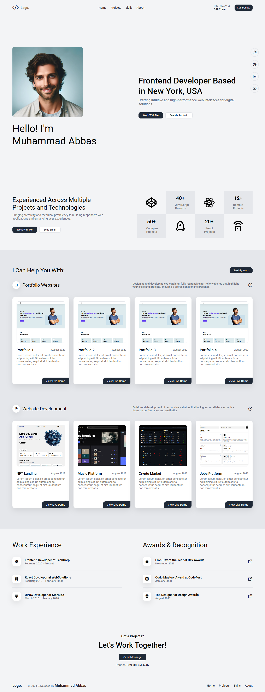

# 🌐 Personal Portfolio Website – Frontend Developer

A clean, responsive, and professional portfolio website to showcase my web development skills, projects, and experience. This site reflects my personal brand as a frontend developer focused on building intuitive and high-performance web interfaces.

---

## 📸 Preview



---

## 🧩 Features

### 👋 Hero & Introduction
- Personal intro with location and real-time clock
- Tagline: “Frontend Developer Based in New York, USA”
- Call-to-action buttons: “Work With Me” and “See My Portfolio”

### 💼 Projects Showcase
- **Portfolio Websites**: Modern, responsive templates with live previews
- **Web Development Projects**: Includes landing pages, web apps, and platforms
- Each card displays a project preview, title, date, and "View Live Demo" link

### 🧠 Work Experience
- Frontend Developer at TechCorp (2020–Present)
- React Developer at WebSolutions (2018–2020)
- UI/UX Developer at StartupX (2016–2018)

### 🏆 Awards & Recognition
- 🥇 Front-End Developer of the Year @ Dev Awards
- 🏆 Code Mastery Award @ CodeFest
- ✨ Top Designer @ Design Awards

### 📬 Contact Section
- Clear invitation to collaborate
- "Send Message" button
- Phone number listed for direct communication

### 🌙 Other Highlights
- Dark/light mode toggle support
- Clean typography and spacing
- Fully mobile-responsive layout

---

## 🛠 Tech Stack

- **HTML5** – Semantic structure
- **CSS3** – Modern layout, animations, responsiveness
- **JavaScript (Vanilla)** – Interactivity and behavior
- *(Optional)* PHP – For contact form handling (if implemented)

---

## 🧪 How to Use

1. Clone the repository:
   ```bash
   git clone https://github.com/your-username/personal-portfolio-2.git
   ```

2. Open `index.html` in your browser.

3. Replace placeholder text, projects, contact info, and social links with your own.

4. Deploy it to GitHub Pages, Netlify, Vercel, or any hosting provider.

---

## 🌟 Live Demo

> [🔗 Add your hosted site link here]

---

## 📫 Contact Me

- **LinkedIn**: [linkedin.com/in/your-profile](https://linkedin.com/in/your-profile)
- **Email**: your.email@example.com
- **Phone**: +1111111111

---

> 💡 Feel free to fork this repo, customize it, and use it to build your own developer portfolio!
